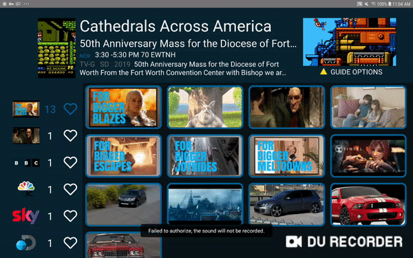

# Alto React Native IPTV App 3

<kbd>
	
</kbd>

`
1. Create ReactNative Channel guide App
2. Channel guide info should be sourced from JSON object. All info including background scheme and layout should be on JSON object.
3. JSON object should be obtained from cloud server using OAUTH2.0 based socket connection.
4. Selecting a channel should open exoplayer with URL provided in JSON. URL can be UDP,HTTP or RTSP
5. Have button on screen to open custom web browser (webview 83). Web browser should be embedded in the app. System webview might be lower version.
`
